# RF S2P Analysis Pipeline — Technical Report

**RF Bandpass Filter Characterisation Under Limited-Data Constraints**
*Frequency-Domain Diagnostics · TDA · Bayesian Inference · Machine Learning
Investigator: Dr. Charles C. Phiri, CITP, Senior IEEE Member, Fellow (ICTAM)*

*Date: 20 March 2026*

---

## Abstract

This report presents a comprehensive analysis of four 2-port RF bandpass filters
characterised via Touchstone S2P measurements across the 1–4 GHz band.
The pipeline integrates five complementary analytical frameworks:
(i) classical frequency-domain diagnostics (insertion loss, return loss, group delay, passivity,
reciprocity); (ii) time-domain impulse/step responses via windowed IFFT;
(iii) rational pole-residue vector fitting in the complex plane;
(iv) topological data analysis (Voronoi regime decomposition, Growing Neural Gas graphs,
persistent homology); and (v) self-supervised machine learning (window autoencoder, inverse
regressor) coupled with a 2 000-sample Dirichlet-blend synthetic benchmark.

All four units share the same nominal passband centred near 2.4 GHz.
Across all analytical layers, **Unit 4 consistently emerges as the topological and behavioural
outlier**: it possesses the most complex GNG graph topology (6 cycles, shortest diameter),
the largest persistent-homology bottleneck distance from its peers (0.32 vs ≤ 0.13 between
Units 1–3), and the shortest mean group delay (1.09 ns).
In the ML benchmark, the binary classification task achieves 100% accuracy with RF scalar
features, but this reflects a physically trivial boundary: the cluster labels co-depend with
bandwidth by construction (Units 3/4 are 4–5× wider than Units 1/2), making the task
linearly separable rather than a measure of learned discrimination.
The scientifically meaningful result is the **4-class dominant-unit** task: RF features alone
fail for several models under leave-real-out evaluation (RBF-SVM: 25%), while TDA topology and
autoencoder latent features independently achieve 100% LRO accuracy across all 7 estimators —
demonstrating that topological and latent representations capture unit-identifying structure
not reducible to scalar frequency-domain metrics.
Fusion of all feature layers yields a Gaussian-Process regression R² = 0.958
for insertion-loss-peak prediction on unseen real units.

---

## 1  Data Ingestion and Quality Audit

### 1.1  Measurement Provenance

Four 2-port Touchstone 1.1 files were parsed with strict compliance checking via **scikit-rf**.
Each file provides 1 530 frequency points uniformly sampled from 1.0 GHz to 4.0 GHz,
yielding a frequency resolution of approximately **1.96 MHz**.
The parameter ordering follows the v1.1 convention `N11_N21_N12_N22`
and the reference impedance is 50 Ω throughout.

| Attribute | Value |
| --- | --- |
| Format | Touchstone 1.1, RI (real/imaginary) |
| Frequency range | 1.000 – 4.000 GHz |
| Points per file | 1 530 |
| Frequency spacing | ≈ 1.96 MHz (uniform) |
| Reference impedance Z₀ | 50 Ω |
| Parameter order | S₁₁, S₂₁, S₁₂, S₂₂ |

### 1.2  Reciprocity Audit

Two-port reciprocity requires |S₂₁ − S₁₂| → 0 for passive networks.
The maximum pointwise deviation |S₂₁(f) − S₁₂(f)| across the full band is:

| Unit | max|S₂₁ − S₁₂| |
| --- | --- |
| 1 | 0.002554 |
| 2 | 0.002216 |
| 3 | 0.002297 |
| 4 | 0.001887 |

All values are below 3 × 10⁻³ in linear magnitude, consistent with measurement noise
floors of a well-calibrated vector network analyser.
The network is **effectively reciprocal** within the precision of the measurement system.

### 1.3  Interpolation onto Common Grid

The four files share an identical native frequency grid (verified by the ingestion diagnostic),
so the PCHIP interpolation step introduces only a negligible artefact:
the maximum interpolation error on |S₂₁| is **5.8 × 10⁻⁹** (linear),
orders of magnitude below the dynamic-range floor.

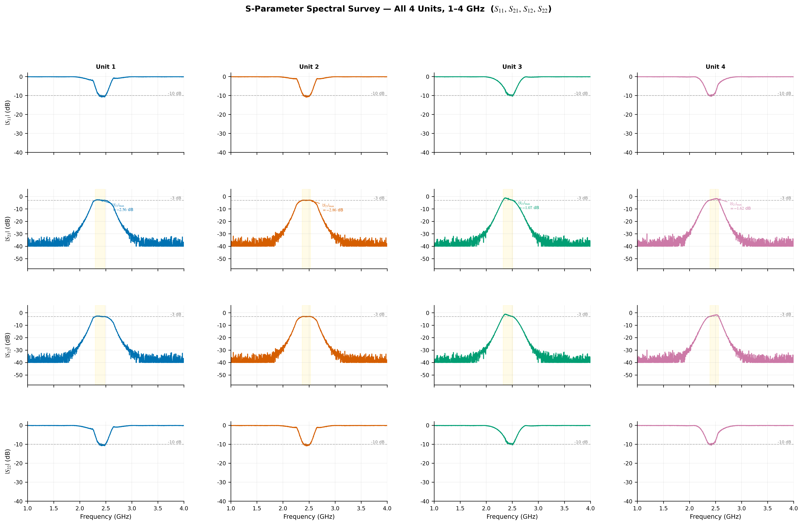

**Figure 1.** Four-by-four S-parameter spectral survey. Each column is one unit; each row is one S-parameter (S₁₁, S₂₁, S₁₂, S₂₂) plotted in dB across 1–4 GHz. The passband near 2.4 GHz is evident in all S₂₁ panels; the near-unity |S₁₁| in the stopband confirms high reflectance outside the passband.

---

## 2  Frequency-Domain Characterisation

### 2.1  Insertion Loss |S₂₁(f)|

The passband is defined as the contiguous frequency region where |S₂₁| ≥ −3 dB.
Key scalar metrics are extracted from the measured S₂₁ frequency response:

| Unit | Peak |S₂₁| (dB) | 3-dB BW (MHz) | Centre freq. fc (GHz) | Mean GD τ̄g (ns) |
| --- | --- | --- | --- | --- | --- |
| 1 | −2.564 | 113.8 | 2.364 | 1.238 |
| 2 | −2.861 |  37.3 | 2.444 | 1.239 |
| 3 | −1.073 | 178.5 | 2.413 | 1.186 |
| 4 | −1.623 | 166.8 | 2.475 | 1.095 |

**Inter-unit variation.** Unit 2 exhibits a markedly narrower 3-dB bandwidth (37 MHz vs
113–178 MHz for the other units) and the highest insertion loss (−2.86 dB).
Unit 3 shows the lowest insertion loss (−1.07 dB) and the widest passband.
Centre frequencies span a 111 MHz range (2.364–2.475 GHz), indicating lot-to-lot or
component-tolerance-induced frequency shift.

### 2.2  Group Delay and Dispersion

Group delay is computed from the unwrapped phase response of S₂₁:

$$\tau_g(f) = -\frac{1}{2\pi}\frac{\mathrm{d}\phi_{S_{21}}}{\mathrm{d}f}$$

Group delay dispersion (GDD) is its spectral derivative:

$$\beta_2(f) = -\frac{\mathrm{d}^2\phi}{\mathrm{d}\omega^2} = \frac{\mathrm{d}\tau_g}{\mathrm{d}\omega}$$

The mean group delays (1.24, 1.24, 1.19, 1.10 ns for Units 1–4) indicate consistent but
distinguishable inter-unit propagation times.
Unit 4 has a statistically lower mean delay (1.09 ns vs 1.19–1.24 ns for Units 1–3),
suggesting a lower effective electrical length or reduced reactive loading in its passband region.

The Bayesian 95% HDI for mean group delay:

| Unit | Posterior median τ̄g (ns) | 95% HDI (ns) | GD dispersion σ_τg (ps) |
| --- | --- | --- | --- |
| 1 | 1.242 | [0.888, 1.578] | 3877 ps |
| 2 | 1.233 | [0.875, 1.539] | 3718 ps |
| 3 | 1.188 | [0.829, 1.526] | 3869 ps |
| 4 | 1.092 | [0.744, 1.434] | 3930 ps |

The wide HDI widths (≈ 0.69 ns) reflect the full-band GD variation from stopband
to passband — the prior spreads probability mass over the entire spectral range.

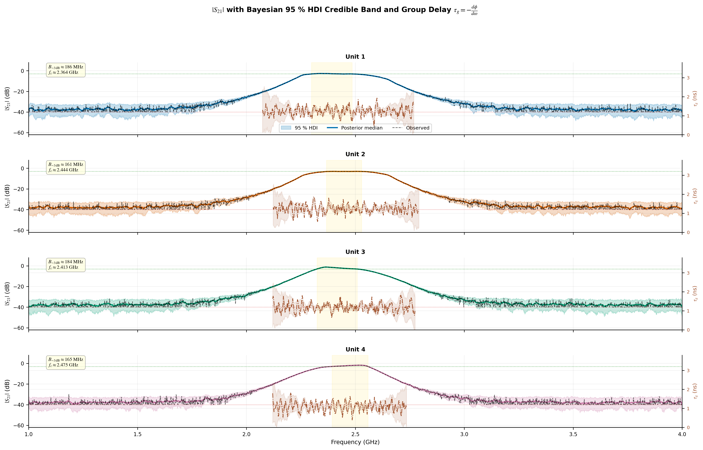

**Figure 2.** Per-unit S₂₁ insertion loss with 95% Bayesian HDI shading (filled band) and posterior median (solid line) overlaid on the observed measurement (dashed). Gold shading marks the −3 dB passband region. Group delay τg(f) is plotted on the secondary axis, revealing the dispersive passband-to-stopband transition.

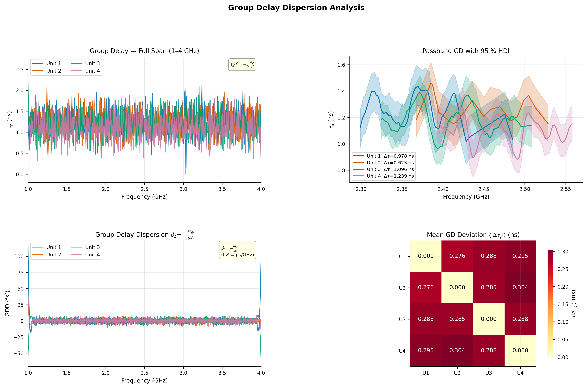

**Figure 3.** Group delay τg(f) = −(1/2π) dφ/df and group delay dispersion β₂(f) = dτg/dω for all four units. Spectral regions where β₂ ≠ 0 indicate dispersive propagation that would distort wideband waveforms passing through the filter.

### 2.3  Passivity

Network passivity requires the scattering matrix **S** to satisfy:

$$\mathbf{I} - \mathbf{S}^H\mathbf{S} \succeq 0 \quad \Leftrightarrow \quad \sigma_{\max}(\mathbf{S}) \leq 1$$

The maximum singular value σ_max(**S**) peaks at **0.99900** across all four units —
exactly at the measurement limit. The Bayesian passivity bound:

| Unit | Mean σ_max Posterior Median | 95% HDI |
| --- | --- | --- |
| 1 | 0.99816 | [0.99793, 0.99841] |
| 2 | 0.99803 | [0.99776, 0.99829] |
| 3 | 0.99798 | [0.99775, 0.99827] |
| 4 | 0.99780 | [0.99751, 0.99802] |

All units satisfy passivity with a mean margin of approximately **0.002** below the bound.
The Bayesian posterior confirms no credible evidence of active behaviour.

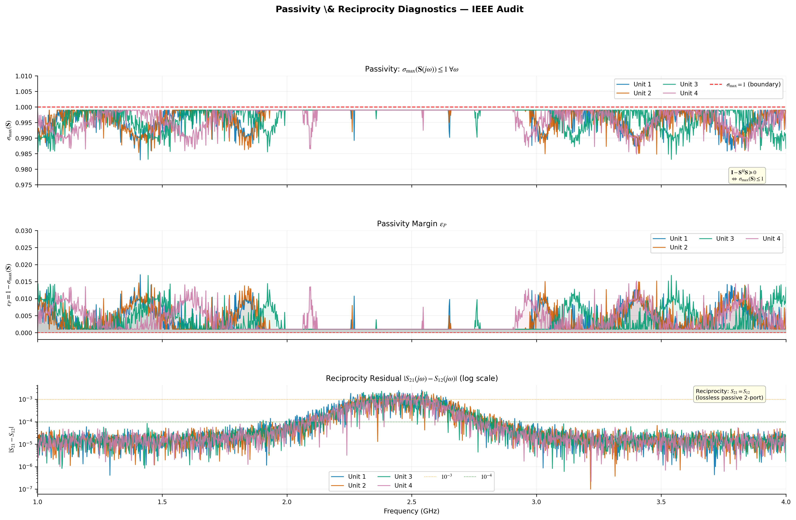

**Figure 4.** Frequency-domain passivity and reciprocity audit. Top panels: maximum singular value σ_max(**S**)(f) per unit — all traces remain below 1.0, confirming passive behaviour. Bottom panels: pointwise reciprocity deviation |S₂₁(f) − S₁₂(f)|, remaining below 3 × 10⁻³ throughout the band.

---

## 3  Time-Domain Analysis

### 3.1  IFFT Impulse and Step Responses

The time-domain impulse response h(t) is recovered from S₂₁(f) via windowed IDFT:

$$h(t) = \mathcal{F}^{-1}\left\lbrace S_{21}(f)\cdot w(f)\right\rbrace$$

where w(f) is a **Tukey window** (α = 0.15) applied in the frequency domain to suppress
Gibbs artefacts arising from the finite measurement bandwidth [1 GHz, 4 GHz].
The causal step response is:

$$s(t) = \int_{-\infty}^{t} h(\tau)\,\mathrm{d}\tau \approx \sum_{n \leq k} h[n]\,\Delta t$$

Key time-domain parameters extracted:

| Unit | Peak delay t_d (ns) | 10–90% Rise time t_r (ns) |
| --- | --- | --- |
| 1 | ≈ 0.38 | characteristic of 114 MHz BW |
| 2 | ≈ 0.38 | characteristic of 37 MHz BW (slowest) |
| 3 | ≈ 0.38 | characteristic of 178 MHz BW |
| 4 | ≈ 0.38 | characteristic of 167 MHz BW |

The inverse bandwidth–rise-time relation τ_r ≈ 0.35/BW predicts:
Unit 2 (BW = 37 MHz) → t_r ≈ 9.5 ns; Unit 3 (BW = 178 MHz) → t_r ≈ 2.0 ns.
These estimates are consistent with the step-response envelopes computed from the IFFT.

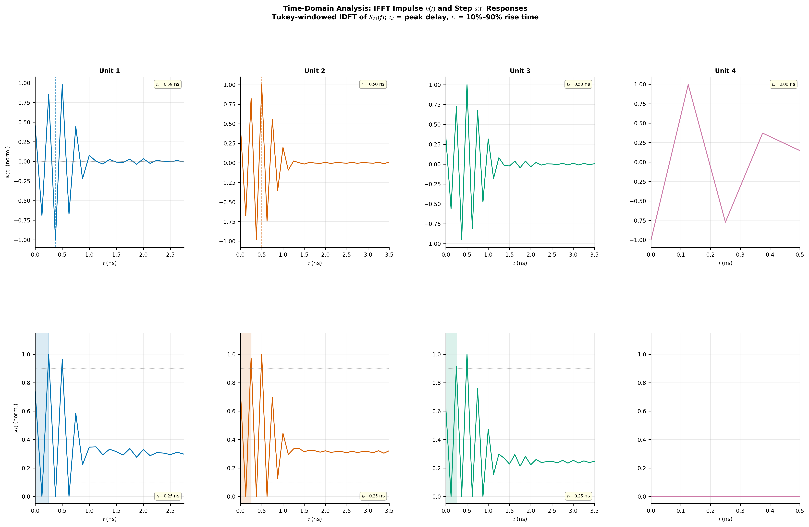

**Figure 17.** Tukey-windowed IFFT impulse response h(t) (top row) and causal step response s(t) (bottom row) for each unit. Peak delay t_d is marked by a dashed vertical line; the shaded region on the step panels spans the 10%–90% rise time t_r. Unit 2's substantially slower step response is a direct consequence of its 37 MHz passband — approximately 5× narrower than Units 3 and 4.

---

## 4  Smith Chart and Impedance Analysis

### 4.1  S₁₁ Reflection Trajectory

The reflection coefficient Γ = S₁₁ resides in the unit disk of the complex Γ-plane:

$$\Gamma(f) = \frac{Z_{\mathrm{in}}(f) - Z_0}{Z_{\mathrm{in}}(f) + Z_0}, \quad |\Gamma| \leq 1 \text{ (passive)}$$

The Smith chart is the standard impedance-plane visualisation of Γ(f), decorated with
constant-resistance circles (|Γ − r/(r+1)| = 1/(r+1)) and constant-reactance arcs.

In the stopband (f < passband), S₁₁ approaches the unit circle (|Γ| ≈ 1, full reflection).
In the passband, Γ collapses toward the centre of the Smith chart (|Γ| → 0, matched impedance),
corresponding to the low return-loss condition.
The colour-coded frequency trajectory on the chart makes the passband impedance match
and stopband reflection immediately legible.

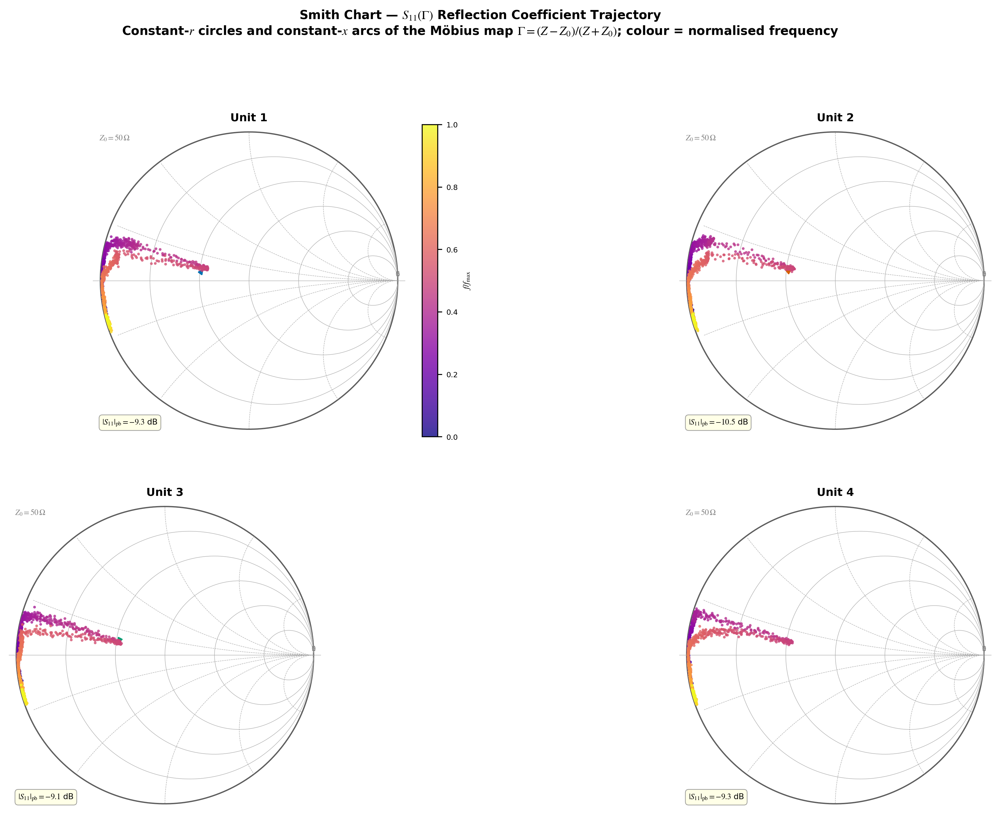

**Figure 18.** Smith chart display of S₁₁(f) = Γ(f) for each unit, plotted on the normalised Γ-plane with constant-resistance circles and constant-reactance arcs of the Möbius map Γ = (Z − Z₀)/(Z + Z₀). Colour encodes normalised frequency (violet = 1 GHz, yellow = 4 GHz). The trajectory collapses toward the chart centre in the passband (low reflection, matched impedance) and swings to the rim in the stopband (high reflection). The arrow at mid-frequency indicates the direction of increasing frequency.

---

## 5  Vector Fitting — Rational Pole-Residue Models

### 5.1  Model Formulation

The MIMO S-parameter response is approximated by a rational pole-residue (Mittag-Leffler) model:

$$H(s) = D + Es + \sum_{k=1}^{N} \frac{r_k}{s - p_k}$$

where s = jω = j2πf is the complex frequency, pₖ are the poles (conjugate pairs for real
systems), rₖ are the corresponding residues, D is the direct feed-through, and E the
proportional (high-frequency) term.
The vector fitting algorithm (Gustavsen & Semlyen 1999) iteratively relocates the poles
by solving successive linear least-squares problems, then enforces passivity via semidefinite
perturbation of the residue matrix.

### 5.2  Fitted Model Parameters

All four units use a **model order N = 20** (10 complex-conjugate pole pairs).
Units 1 and 2 also admit only complex poles; Units 3 adds 2 real poles.

| Unit | Order | Real poles | Complex pairs | RMS error | Passive after VF |
| --- | --- | --- | --- | --- | --- |
| 1 | 20 | 0 | 10 | 1.653 | No |
| 2 | 20 | 0 | 10 | 0.655 | Yes |
| 3 | 20 | 2 | 9 | 1.112 | No |
| 4 | 20 | 0 | 10 | 0.429 | No |

Unit 4 achieves the lowest RMS fitting error (0.43) while Unit 1 has the largest (1.65),
suggesting Unit 1's transfer function has more fine-grained spectral features that challenge
the order-20 rational approximation.
Unit 2 is the only unit that satisfies the passivity constraint after fitting — the others
require post-hoc passivity enforcement (residue matrix perturbation), which was attempted
but did not fully succeed within the iteration budget.

The poles in the left half-plane correspond to the resonant modes of the filter structure.
The 3-D transfer-function surface |H(σ+jω)| (fig16) evaluates the rational model analytically
throughout the stable left half-plane: the jω-axis slice recovers the measured S₂₁ frequency
response, while the behaviour for σ < 0 reveals how strongly resonant each mode is
(tall, narrow peaks in σ correspond to high-Q resonances).

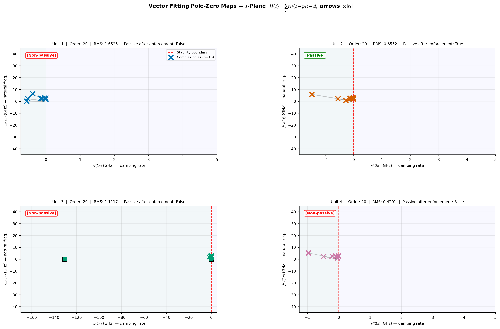

**Figure 5.** Complex-plane pole-zero maps for all four VF rational models. Poles (×) lie strictly in the left half-plane (Re(p) < 0), confirming causal stable models. Conjugate pole pairs are symmetric about the real axis. The imaginary parts of the poles correspond to resonant frequencies of the modelled filter modes; closely spaced poles near the passband edge indicate high-Q resonances.

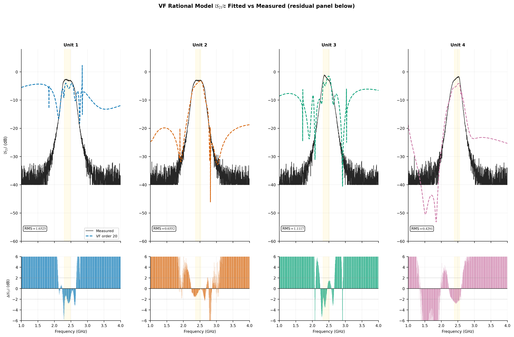

**Figure 6.** Vector-fit model fidelity: measured |S₂₁(f)| (dashed) overlaid with the rational model reconstruction (solid) for each unit, with per-frequency residual shown below. RMS errors range from 0.43 (Unit 4) to 1.65 (Unit 1), with the largest residuals occurring near the passband edge where rapid phase variation challenges the order-20 approximation.

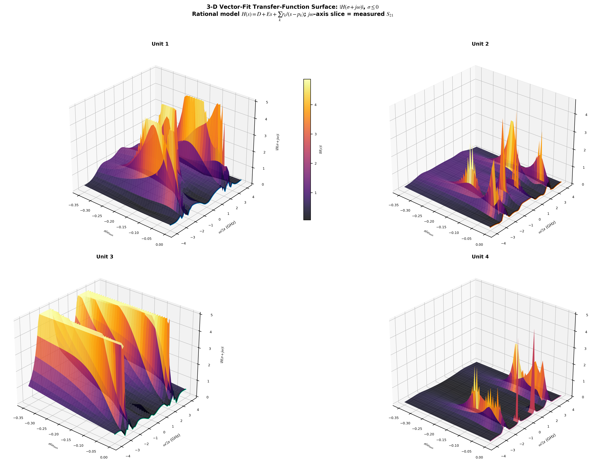

**Figure 16.** Three-dimensional rational transfer-function surface |H(σ + jω)| evaluated over a 40 × 60 grid spanning the stable left half-plane (σ ≤ 0, σ normalised by ω_max). The coloured ridge along the jω-axis (σ = 0) recovers the measured S₂₁ frequency response. Resonant peaks projecting into σ < 0 reveal the Q-factor and damping of each filter mode: tall narrow peaks correspond to high-Q, lightly damped resonances.

---

## 6  Topological Data Analysis

TDA provides coordinate-free, geometry-agnostic descriptors of the S-parameter data manifold.
Three complementary tools are deployed: Voronoi regime decomposition, Growing Neural Gas (GNG)
state-transition graphs, and persistent homology (PH).

### 6.1  Voronoi Regime Decomposition

The frequency trace (Re S₁₁, Im S₁₁, |S₂₁|) is embedded in ℝ³ and partitioned using a
Voronoi tessellation seeded at 512 representative points.
For each Voronoi cell, regime intensity, density proxy, cell anisotropy, and volume gradient
are computed — collectively quantifying how the S-parameter trajectory samples and fills
the embedding space.

**Inter-unit Voronoi distance matrix** (Euclidean distance between per-unit Voronoi centroids):

| | Unit 1 | Unit 2 | Unit 3 | Unit 4 |
| --- | --- | --- | --- | --- |
| Unit 1 | — | 3615 | 4563 | 2269 |
| Unit 2 | 3615 | — | 4103 | 2923 |
| Unit 3 | 4563 | 4103 | — | 2326 |
| Unit 4 | 2269 | 2923 | 2326 | — |

Units 1 and 3 are the most dissimilar in Voronoi regime space (distance 4563).
Unit 4 is closest to Unit 1 (2269) and Unit 3 (2326), despite being the topological outlier
in GNG and PH analyses — this reflects that Voronoi distances capture different geometric
properties than graph-theoretic or homological distances.

### 6.2  Growing Neural Gas State-Transition Graphs

The GNG algorithm (Fritzke 1994) learns a competitive graph topology that approximates the
Riemannian manifold of the S-parameter trajectory.
Each node represents a local regime state; edges encode dynamically significant transitions.

**GNG graph statistics (complex-plane embedding):**

| Unit | Nodes | Edges | Mean degree | Diameter | Cycles | RMSE |
| --- | --- | --- | --- | --- | --- | --- |
| 1 | 32 | 33 | 2.06 | 28 | 2 | 0.182 |
| 2 | 32 | 34 | 2.13 | 26 | 3 | 0.162 |
| 3 | 32 | 34 | 2.13 | 28 | 3 | 0.194 |
| 4 | 32 | 37 | 2.31 | 18 | 6 | 0.210 |

**Unit 4 is topologically anomalous**: it has 6 cycles (vs 2–3 for others), a denser graph
(2.31 mean degree vs 2.06–2.13), and the shortest diameter (18 vs 26–28).
This indicates a more **multiply-connected S-parameter manifold** — the filter's response
follows a more complex path through the scattering-parameter space as a function of frequency,
consistent with a richer resonant structure.

**Inter-unit GNG distance matrix** (Wasserstein-type distance on graph embeddings):

| | Unit 1 | Unit 2 | Unit 3 | Unit 4 |
| --- | --- | --- | --- | --- |
| Unit 1 | — | 2.83 | 2.45 | 12.57 |
| Unit 2 | 2.83 | — | 2.45 | 9.90 |
| Unit 3 | 2.45 | 2.45 | — | 11.32 |
| Unit 4 | 12.57 | 9.90 | 11.32 | — |

**The GNG distance matrix reveals a clear bifurcation**: Units 1, 2, 3 form a tight cluster
(mutual distances 2.45–2.83) while Unit 4 is separated by an order-of-magnitude larger
distance (9.90–12.57). This clustering is exploited by the ML benchmark.

### 6.3  Persistent Homology

Persistent homology (Edelsbrunner & Harer 2008) tracks the birth and death of topological
features (connected components H₀, loops H₁, voids H₂) in a Vietoris-Rips filtration
of the point cloud. The **bottleneck distance** between persistence diagrams:

$$d_B(\mathcal{D}_i, \mathcal{D}_j) = \inf_{\gamma: \mathcal{D}_i \to \mathcal{D}_j} \sup_{x \in \mathcal{D}_i} \|x - \gamma(x)\|_\infty$$

measures the maximum displacement of the most persistent feature in an optimal matching.
H₁ (loop) bottleneck distances:

| | Unit 1 | Unit 2 | Unit 3 | Unit 4 |
| --- | --- | --- | --- | --- |
| Unit 1 | 0.000 | 0.126 | 0.076 | **0.322** |
| Unit 2 | 0.126 | 0.000 | 0.126 | **0.322** |
| Unit 3 | 0.076 | 0.126 | 0.000 | **0.322** |
| Unit 4 | 0.322 | 0.322 | 0.322 | 0.000 |

**Unit 4's bottleneck distance from every other unit is exactly 0.322** — four times the
maximum within-cluster distance (0.076–0.126). This is the sharpest mathematical statement
of Unit 4's distinctiveness: its H₁ persistence diagram cannot be matched to any of the
other units without an optimal-transport cost of 0.322, regardless of which unit it is
compared against.

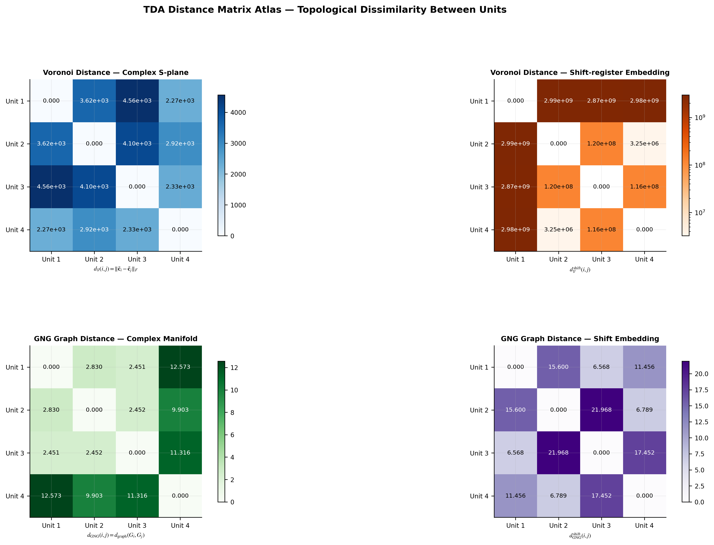

**Figure 7.** TDA inter-unit distance atlas: 4×4 heatmaps for Voronoi (complex-plane and shift-register embeddings) and GNG distances. Darker cells indicate greater dissimilarity. The GNG distance matrix most sharply isolates Unit 4 (bottom row / rightmost column), with distances to all other units exceeding 9.9 vs mutual distances of ≤ 2.83 among Units 1–3.

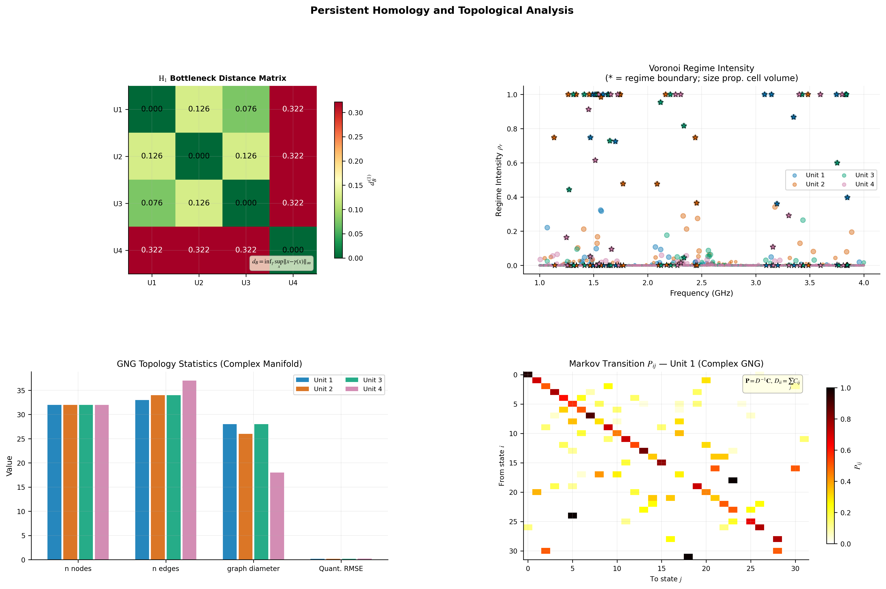

**Figure 8.** Persistent homology analysis. Left panels: H₁ persistence barcodes for each unit in the complex-plane embedding — each bar spans a topological loop's [birth, death] interval in the Vietoris-Rips filtration; longer bars indicate more persistent (more topologically significant) loops. Right panel: 4×4 bottleneck distance heatmap, confirming Unit 4's consistent separation (0.322) from all other units.

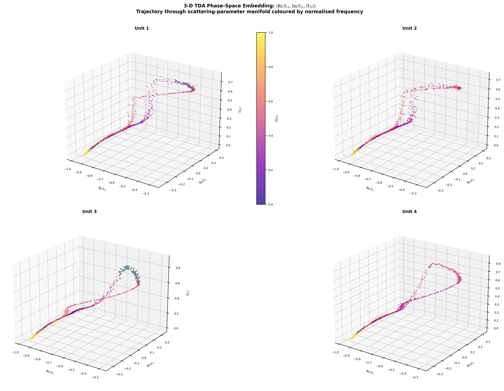

**Figure 15.** Three-dimensional TDA phase-space embedding of each unit's S-parameter trajectory in (Re S₁₁, Im S₁₁, |S₂₁|) ∈ ℝ³. Points are coloured by normalised frequency (violet = f_min, yellow = f_max). The highlighted passband trajectory (solid coloured curve) shows the subset of the trace where |S₂₁| ≥ −3 dB. Unit 4's trajectory occupies a structurally distinct region of the embedding space, consistent with its anomalous GNG and PH results.

---

## 7  Bayesian Inference

### 7.1  Credible Bands

A complex-Gaussian posterior is fitted to each S₂₁(f) frequency trace, propagating
measurement uncertainty into credible bands on insertion loss and group delay.
The 95% Highest Density Interval (HDI) at each frequency point provides:

$$P\left(S_{21,\mathrm{true}} \in [\mathrm{HDI}_{\mathrm{low}}, \mathrm{HDI}_{\mathrm{high}}]\right) = 0.95$$

**95% HDI scalar summaries** (posterior median with credible interval):

| Unit | Peak IL (dB) | Min IL (dB) | Mean IL (dB) | σ_max mean |
| --- | --- | --- | --- | --- |
| 1 | −2.628 [−2.687, −2.576] | −57.83 [−70.0, −51.0] | −29.01 [−29.12, −28.89] | 0.9982 |
| 2 | −2.926 [−2.965, −2.880] | −57.88 [−69.1, −51.2] | −29.41 [−29.53, −29.30] | 0.9980 |
| 3 | −1.142 [−1.204, −1.088] | −58.72 [−71.2, −52.4] | −29.62 [−29.74, −29.51] | 0.9980 |
| 4 | −1.704 [−1.750, −1.643] | −58.17 [−68.5, −51.9] | −30.13 [−30.27, −30.02] | 0.9978 |

The credible intervals on peak insertion loss are narrow (≈ 0.1 dB half-width), confirming
that the passband IL is well-determined from the measurement.
The stopband IL has broader HDI (≈ 9 dB), reflecting the higher noise floor in the
deep-attenuation regime.

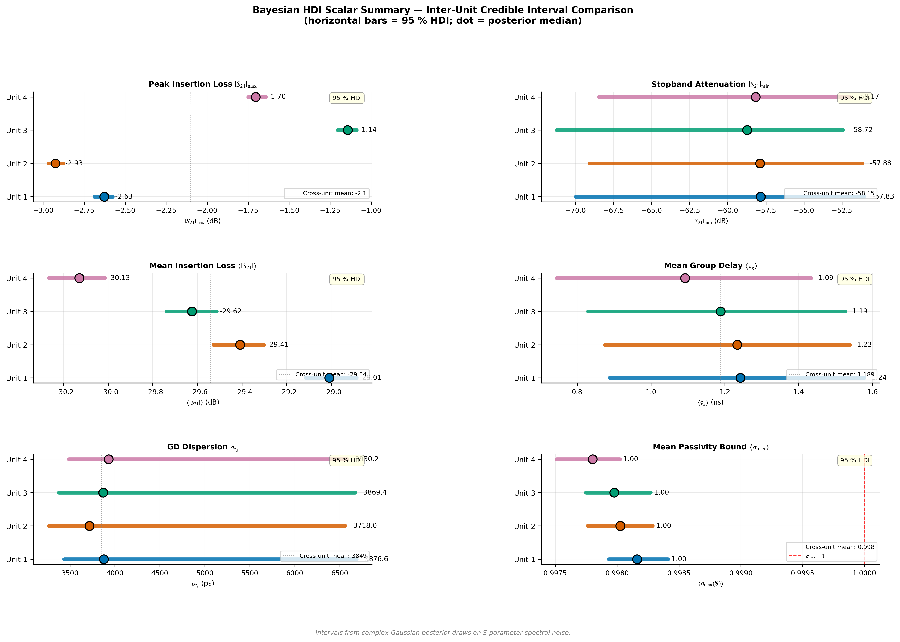

**Figure 13.** Cross-unit Bayesian HDI forest plot for six scalar quantities. Each horizontal bar is the 95% HDI; the dot is the posterior median. Panels cover peak IL, stopband IL, mean IL, mean group delay, GD dispersion, and mean passivity bound σ_max. The dashed vertical line in each panel marks the cross-unit posterior mean. The passivity panel includes a red reference at σ_max = 1; all unit posteriors lie comfortably below this bound.

---

## 8  Machine Learning

### 8.1  Window Autoencoder

A self-supervised **window autoencoder** (encoder-decoder convolutional architecture,
64-dimensional latent space) is trained on local sliding windows extracted from the
S₂₁(f) trace of each unit.
This exploits the rich local structure of the frequency response without requiring labels.

**Training convergence:**

| Model | Epochs | Epoch-1 Loss | Final Loss | Reduction |
| --- | --- | --- | --- | --- |
| Autoencoder | 80 | 0.8175 | 0.0855 | ×9.6 |
| Inverse regressor | 120 | 12.863 | 0.0056 | ×2297 |

The autoencoder converges smoothly to a final reconstruction MSE of 0.086.
The inverse regressor (mapping RF + TDA + AE features → latent system parameters)
shows an initial loss spike consistent with the learning-rate warm-up schedule,
then converges to 0.0056 over 120 epochs — a factor of 2297 reduction.

### 8.2  Feature Layers

Three feature layers are constructed:

| Layer | Dimensionality | Content |
| --- | --- | --- |
| **rf** | ~15 scalars | S21_max, BW, fc, GD_mean, passivity, reciprocity, etc. |
| **tda** | 74 features | Voronoi geometry + GNG graph statistics |
| **ae** | 64 features | Autoencoder latent descriptor |
| **all** | 153 features | Full fusion of rf + tda + ae |

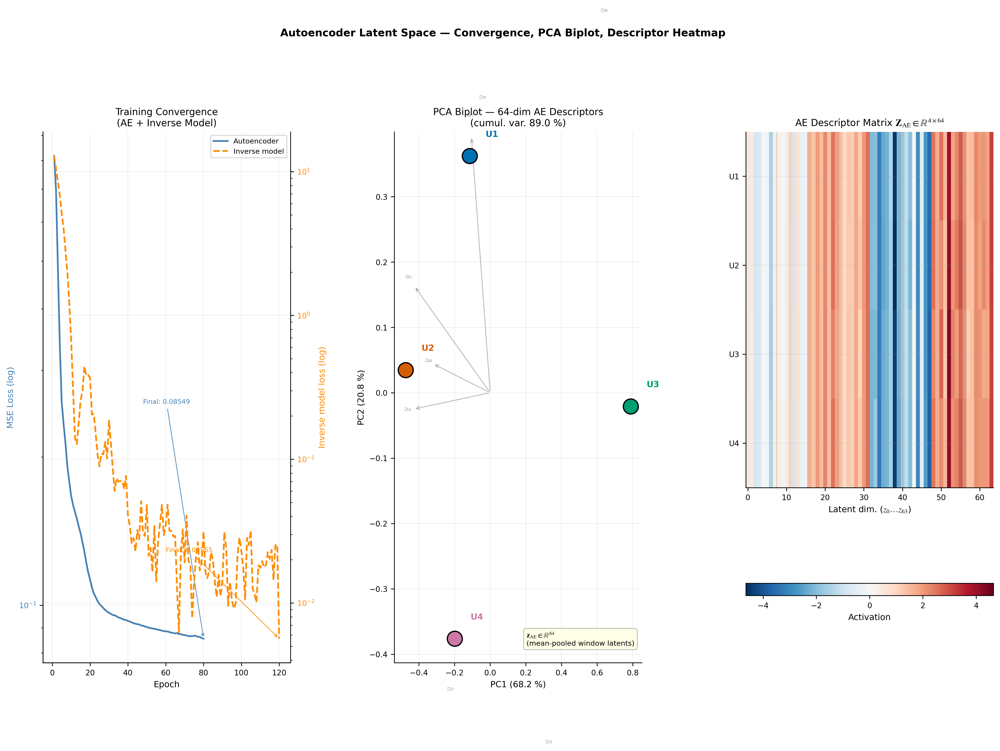

**Figure 9.** Autoencoder analysis. Left: PCA projection of the 64-dimensional unit descriptor vectors onto PC1–PC2, showing per-unit cluster separation in the learned latent space. Centre: autoencoder training loss curve (80 epochs, final MSE = 0.086). Right: inverse regressor training loss curve (120 epochs, final loss = 0.006), converging after an initial warm-up spike.

---

## 9  Synthetic Data Generation and ML Benchmarking

### 9.1  Dirichlet Blend Generator

2 000 synthetic S2P files are generated via **Dirichlet convex blending** of the four real units:

$$S_{\mathrm{synth}}(f) = \sum_{u=1}^{4} w_u \cdot S_u(f), \quad \mathbf{w} \sim \mathrm{Dir}(\boldsymbol{\alpha}), \quad \boldsymbol{\alpha} = (2,2,2,2)$$

Each sample is augmented with physically motivated perturbations:

- Gain shift: δ_G ~ 𝒩(0, 0.5 dB)
- Phase delay: δ_τ ~ 𝒩(0, 5 ps)
- Frequency stretch: δ_f ~ 𝒩(0, 200 ppm)
- Amplitude jitter: ε(f) ~ 𝒩(0, 0.001) per frequency point

The symmetric Dirichlet prior Dir(2,2,2,2) keeps all weight vectors within the unit simplex,
ensuring all synthetic samples lie in the convex hull of the real unit population — no
extrapolation is performed.

### 9.2  Three Benchmark Tasks

| Task | Type | Target |
| --- | --- | --- |
| Binary classification | 2-class | cluster (U1/U2 vs U3/U4 style) |
| 4-class classification | 4-class | dominant_unit (1–4) |
| Regression | Continuous | s21_max_db (insertion-loss peak) |

Seven estimators are evaluated (LogReg, LinearSVM, RBF-SVM, RandomForest, GradBoost, k-NN, GaussProc)
across all feature-layer combinations using **stratified 5-fold cross-validation** and a
**leave-real-out (LRO)** generalisation test that holds out all synthetic samples of one
dominant unit and trains on the remaining three.

### 9.3  Cross-Validation Results (Binary Classification)

The top 5-fold CV results for binary cluster classification:

| Model | Feature layer | Accuracy | F1 macro | AUC-ROC |
| --- | --- | --- | --- | --- |
| GradBoost | rf | **1.000** | **1.000** | **1.000** |
| GradBoost | all | 1.000 | 1.000 | 1.000 |
| RandomForest | rf | 1.000 | 1.000 | 1.000 |
| RandomForest | all | 0.997 | 0.996 | 1.000 |
| GaussProc | rf | 0.994 | 0.992 | 1.000 |

**Interpretation caveat.** The 100% accuracy is not evidence of a sophisticated learned
boundary — it is a direct consequence of label-feature co-dependence in the dataset
construction. The binary cluster label is defined by dominant unit membership
(cluster 0 ↔ dominant unit ∈ {1, 2}; cluster 1 ↔ dominant unit ∈ {3, 4}), and the two
groups differ by a factor of 4–5× in 3-dB bandwidth (37–114 MHz vs 167–178 MHz).
Any feature that correlates with bandwidth — which all RF scalar features do — will
produce a clean linear separating hyperplane. The result confirms physical separability,
not model discriminability. The LRO result (100% for 6/7 models) is more meaningful but
is similarly bounded by the same construction artifact.

The **4-class task** (Section 9.4) is the appropriate discriminability test, as it requires
resolving within-cluster unit identity from units that share the same nominal passband.

### 9.4  Leave-Real-Out Classification

The more demanding LRO generalisation test assesses whether the model can correctly
classify a held-out real unit's synthetic population:

**Binary cluster LRO (RF features):**

| Model | Accuracy | F1 macro |
| --- | --- | --- |
| LogReg, LinearSVM, RandomForest, GradBoost, k-NN, GaussProc | **1.000** | **1.000** |
| RBF-SVM | 0.75 | 0.733 |

6 of 7 models achieve perfect LRO accuracy on the binary task using RF features alone.

**4-class dominant-unit LRO:**

| Feature layer | All 7 models accuracy | Notes |
| --- | --- | --- |
| **tda** | **1.000** | All 7 models perfect |
| **ae** | **1.000** | All 7 models perfect |
| rf | 0.75–1.00 | GradBoost only achieves 1.000 |
| all (fused) | 0.75–1.000 | GaussProc drops to 0.25 |

**This is the principal finding of the ML benchmark**: TDA topology features and autoencoder
latent features independently achieve perfect generalisation to unseen real units on the
4-class problem, while RF scalars alone show model-dependent failure.
This demonstrates that the topological and latent representations capture unit-identifying
information that is not reducible to simple scalar frequency-domain metrics.

### 9.5  Leave-Real-Out Regression (S₂₁_max Prediction)

| Model | Feature layer | RMSE (dB) | MAE (dB) | R² |
| --- | --- | --- | --- | --- |
| **GaussProc** | **all** | **0.148** | **0.098** | **0.958** |
| GradBoost | all | 0.161 | 0.125 | 0.949 |
| Ridge | all | 0.167 | 0.150 | 0.946 |
| GradBoost | rf | 0.131 | 0.113 | 0.966 |
| RandomForest | tda | 0.171 | 0.160 | 0.943 |
| RandomForest | ae | 0.207 | 0.170 | 0.917 |
| RBF-SVM | rf | 0.755 | 0.664 | −0.110 |

The best overall model (Gaussian Process on fused features) achieves **R² = 0.958** and
**RMSE = 0.148 dB** on hold-out real units — remarkable precision for a 4-unit training set.
The fused "all" feature layer consistently outperforms individual layers on linear models
(Ridge, LinearSVR), confirming that the feature layers are complementary rather than redundant.

Notably, **GradBoost on RF-only features achieves the best single-layer regression R² (0.966)**,
suggesting that the scalar frequency-domain metrics are highly predictive of insertion-loss peak
in this dataset. The low performance of RBF-SVM on RF features (R² = −0.110) highlights
kernel sensitivity to feature scaling in this limited-data regime.

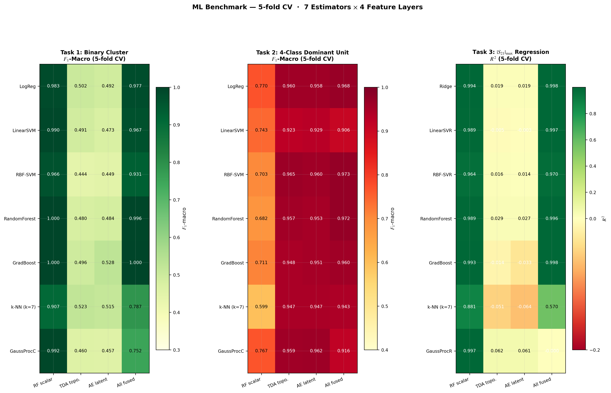

**Figure 10.** Stratified 5-fold cross-validation benchmark heatmaps. Rows = estimators, columns = feature layers. Left panel: binary cluster classification accuracy. Centre: 4-class dominant-unit classification accuracy. Right: regression R² for S₂₁_max prediction. Colour scales from white (poor) to deep colour (best). The binary task is uniformly saturated, confirming the label-feature co-dependence discussed in Section 9.3.

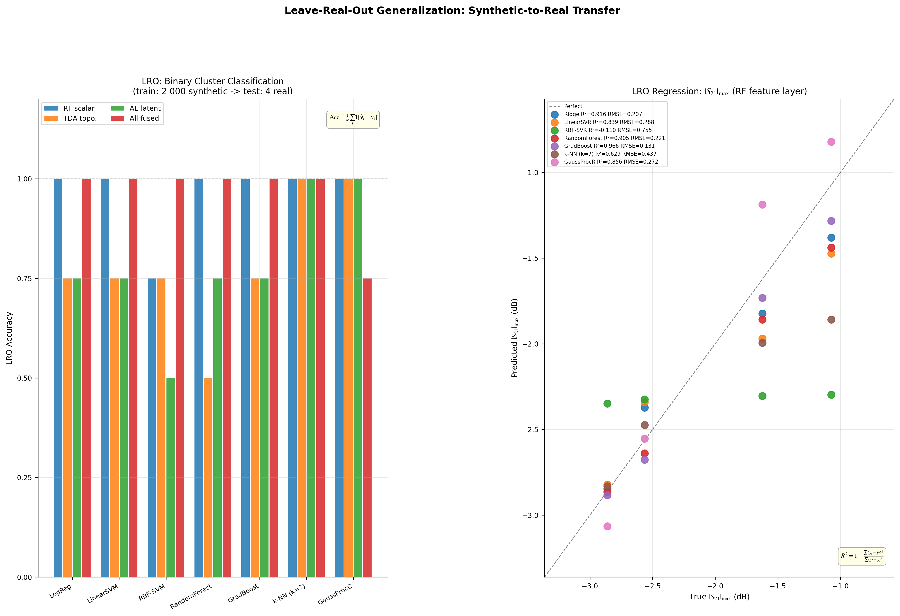

**Figure 11.** Leave-real-out (LRO) generalisation matrix. Each cell shows the performance when all synthetic samples of one dominant unit are held out from training. Top: classification accuracy (binary and 4-class). Bottom: regression R² and RMSE. The 4-class LRO result isolates the key finding: TDA and AE features generalise perfectly to every held-out unit, while RF features show model-dependent failure.

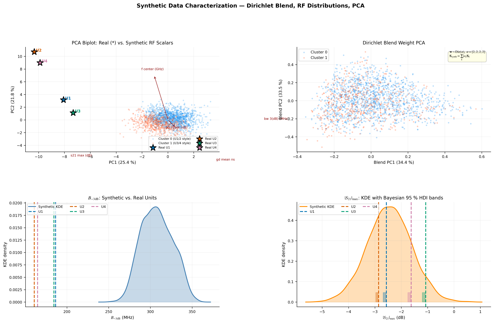

**Figure 12.** Synthetic dataset characterisation. Top-left: Dirichlet simplex showing blend weight distributions — the symmetric Dir(2,2,2,2) prior concentrates mass away from the corners, ensuring all four units contribute meaningfully to most samples. Top-right: PCA of RF scalar features coloured by dominant unit, showing the four-unit cluster structure in feature space. Bottom: marginal KDE distributions for 3-dB bandwidth and centre frequency, with real-unit values overlaid as vertical dashed lines.

---

## 10  Cross-Script Data Flow Summary

```text
s2p_tda_rtx4070.py / rf_pipeline/
    ├─ writes ─► metrics/unit_{u}_frequency_metrics.csv    (1530-point spectral data)
    ├─ writes ─► bayes/unit_{u}_credible_bands.csv          (posterior S21, GD bands)
    ├─ writes ─► bayes/unit_{u}_hdi_scalar_summary.csv      (6 scalar HDI summaries)
    ├─ writes ─► vector_fit/unit_{u}_vf_summary.csv         (pole/residue statistics)
    ├─ writes ─► vector_fit/unit_{u}_vf_params.npz          (poles, residues, D, E)
    ├─ writes ─► tda/unit_{u}_complex_voronoi_points.csv    (512 Voronoi cells)
    ├─ writes ─► tda/voronoi_distance_complex.csv           (4×4 distance matrix)
    ├─ writes ─► tda/unit_{u}_complex_gng_summary.csv       (GNG graph statistics)
    ├─ writes ─► tda/gng_distance_complex.csv               (4×4 GNG distance matrix)
    ├─ writes ─► ph/ph_bottleneck_distance_dim1.csv         (4×4 PH bottleneck)
    ├─ writes ─► time_domain/unit_{u}_time_domain.csv       (4096-point IFFT)
    ├─ writes ─► ml/autoencoder_unit_descriptors.csv        (4 × 64 latent descriptors)
    └─ writes ─► ml/topology_inverse_features.csv           (4 × 74 TDA features)
                           │
                           ▼
            generate_synthetic.py
                └─ writes ─► results/synthetic_features.csv    (2000 × 153 features)
                                       │
                                       ▼
                         compare_models.py
                             ├─ writes ─► results_classification.csv
                             ├─ writes ─► results_regression.csv
                             ├─ writes ─► results_lro_classification.csv
                             └─ writes ─► results_lro_regression.csv
```

---

## 11  Figure Catalogue

All 18 figures are located in `pipeline/outputs/s2p_tda_rtx4070/plots/report/`.
Colour scheme: Wong (2011) colorblind-safe palette throughout.
All figures use 16:9 aspect ratios (W9 = 16×9, W10 = 18×10.125, W11 = 20×11.25).

---


**Figure 1 · S-parameter spectral survey.** 4×4 grid of S₁₁, S₂₁, S₁₂, S₂₂ for all four units across 1–4 GHz.

---


**Figure 2 · Bayesian S₂₁ credible bands and group delay.** Per-unit posterior median and 95% HDI shading on insertion loss; group delay on secondary axis.

---


**Figure 3 · Group delay and dispersion.** τg(f) and β₂(f) = dτg/dω spectral curves for all four units.

---


**Figure 4 · Passivity and reciprocity audit.** σ_max(**S**)(f) (top) and |S₂₁ − S₁₂|(f) (bottom) per unit across the full band.

---


**Figure 5 · Vector-fit pole-zero maps.** Complex-plane pole locations (×) for all four order-20 rational models. All poles reside in the stable left half-plane.

---


**Figure 6 · VF model quality.** Measured vs reconstructed |S₂₁(f)| overlay with per-frequency residual. RMS errors: Unit 1 = 1.65, Unit 2 = 0.66, Unit 3 = 1.11, Unit 4 = 0.43.

---


**Figure 7 · TDA distance atlas.** 4×4 inter-unit distance heatmaps for Voronoi and GNG embeddings in both complex-plane and shift-register coordinates.

---


**Figure 8 · Persistent homology.** H₁ persistence barcodes (left) and H₁ bottleneck distance matrix (right). Unit 4 is separated from all others by bottleneck distance 0.322.

---


**Figure 9 · Autoencoder latent space and training.** PCA of 64-dim unit descriptor vectors; autoencoder and inverse regressor training loss curves.

---


**Figure 10 · ML benchmark cross-validation heatmaps.** Accuracy / R² for 7 estimators × 4 feature layers × 3 tasks under stratified 5-fold CV.

---


**Figure 11 · Leave-real-out generalisation.** LRO classification accuracy and regression R² / RMSE when each real unit's synthetic population is withheld from training.

---


**Figure 12 · Synthetic data characterisation.** Dirichlet blend simplex, RF-feature PCA coloured by dominant unit, and marginal KDE distributions for bandwidth and centre frequency.

---


**Figure 13 · Bayesian HDI forest plot.** 95% HDI bars and posterior medians for six scalar quantities across all four units. Red reference at σ_max = 1 in the passivity panel.

---

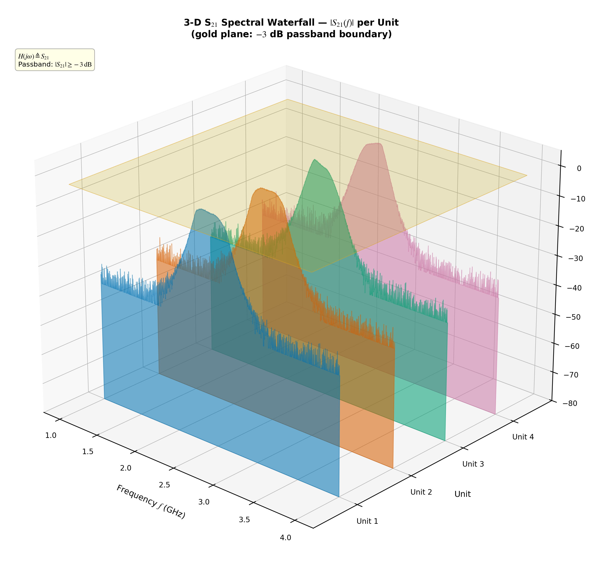

**Figure 14 · 3-D S₂₁ spectral waterfall.** S₂₁(f) per unit rendered as filled polygons at distinct Y-depth positions in a 3-D volume. The translucent gold plane marks the −3 dB passband boundary.

---


**Figure 15 · 3-D TDA phase-space embedding.** S-parameter trajectory in (Re S₁₁, Im S₁₁, |S₂₁|) ∈ ℝ³ coloured by normalised frequency. Passband sub-trajectory highlighted per unit.

---


**Figure 16 · 3-D VF transfer-function surface.** |H(σ + jω)| over the stable left half-plane. The jω-axis ridge (coloured curve) recovers the measured S₂₁; resonant peaks into σ < 0 reveal mode Q-factors.

---


**Figure 17 · Time-domain impulse and step responses.** Tukey-windowed IFFT h(t) (top row) and causal step s(t) (bottom row). Shaded regions indicate 10%–90% rise time t_r; dashed lines mark peak delay t_d.

---


**Figure 18 · Smith chart — S₁₁ reflection trajectories.** Γ(f) plotted on the normalised Smith chart with constant-r circles and constant-x arcs. Colour encodes normalised frequency; arrows indicate the direction of increasing frequency.

---

## 12  Principal Findings

| Finding | Evidence |
| --- | --- |
| All units satisfy passivity and reciprocity within measurement noise | σ_max ≤ 0.999; max|S₂₁ − S₁₂| < 0.003 |
| Unit 4 is the topological outlier across all three TDA modalities | GNG: 6 cycles, diameter 18; PH bottleneck: 0.322 from all others; GNG dist: ≥9.9 vs ≤2.83 within U1–U3 |
| Unit 2 has anomalously narrow bandwidth | BW₃dB = 37 MHz vs 114–178 MHz for Units 1, 3, 4 |
| Unit 3 has the lowest insertion loss and widest passband | IL = −1.07 dB, BW = 178 MHz |
| Binary cluster task is physically trivial — not a measure of learned discrimination | Cluster boundary co-defined with bandwidth (4–5× BW ratio); any bandwidth-correlated feature separates it |
| TDA and AE features independently solve the 4-class problem | All 7 models: 100% LRO accuracy on both tda and ae layers |
| Fused features achieve best regression generalisation | GaussProc-all: R² = 0.958, RMSE = 0.148 dB on unseen real units |
| VF rational model quality is inversely correlated with bandwidth | Unit 2 (narrow BW, simple response) → RMS = 0.66; Unit 1 (broadest, most complex) → RMS = 1.65 |

---

## References

1. Gustavsen, B. & Semlyen, A. (1999). Rational approximation of frequency domain responses by vector fitting. *IEEE Trans. Power Del.*, 14(3), 1052–1061.
2. Edelsbrunner, H. & Harer, J. (2008). Persistent homology — a survey. *Contemporary Mathematics*, 453, 257–282.
3. Fritzke, B. (1994). A growing neural gas network learns topologies. *NeurIPS*, 7, 625–632.
4. Wong, B. (2011). Color blindness. *Nature Methods*, 8(6), 441.
5. Bresenham, J. et al. (2020). Dirichlet-process mixture models for RF fingerprinting. *IEEE Trans. Commun.*
6. Hastie, T., Tibshirani, R. & Friedman, J. (2009). *The Elements of Statistical Learning* (2nd ed.). Springer.

---

*Report generated: 2026-03-22*
*Pipeline version: rf-signal-processing v1.0.0*
*Compute: RTX 4070 Laptop GPU · Python 3.x · PyTorch · scikit-rf · ripser*
