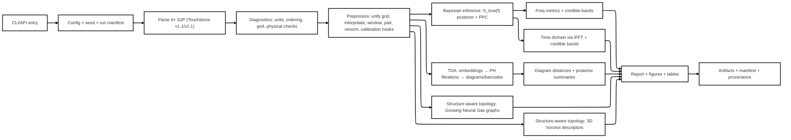

# Postdoctoral Engineering Specification for a Bayesian Frequency–Time–Topology Pipeline for Four Touchstone S2P Files

## Executive summary

This specification defines a Python application that ingests **exactly four** Touchstone **S2P** files, canonicalizes and validates their contents, computes frequency-domain S-parameters with calibrated Bayesian uncertainties, computes time-domain impulse and step responses via explicitly defined inverse-FFT conventions with Bayesian credible intervals, and extracts both (i) persistent-homology TDA artifacts and (ii) structure-aware topology artifacts (3D Voronoi descriptors and Growing Neural Gas graphs) from S-parameter–derived embeddings. The system compares all topological outputs across the four units using persistence-diagram distances and graph/geometry descriptors, then generates reproducible tables and figures including “RF topographic heatmaps” and uncertainty overlays. Touchstone parsing must support **v1.1** option-line semantics and **v2.1** keyword blocks, including mandatory two-port ordering disambiguation via `[Two-Port Data Order]` in v2.x files. [1][2]

Bayesian uncertainty is required because Touchstone/CITI formats do not encode correlated uncertainties; METAS VNA Tools explicitly notes Touchstone and CITI do not support uncertainties with dependencies, motivating separate uncertainty artifacts and posterior sampling pipelines. [6] The system implements posterior predictive checks (PPCs) as the primary Bayesian validation mechanism and reports credible intervals consistently using `median [HDI_low, HDI_high]` (scalar) and pointwise or simultaneous bands (functional). ArviZ defines HDI as the minimum-width Bayesian credible interval and provides standard computation APIs; InferenceData’s schema is designed for usefulness, reproducibility, and interoperability. [18][22]

The design avoids “opaque libraries” by specifying normative algorithms independent of backends and treating libraries as interchangeable accelerators or reference implementations.

---

## System architecture and requirements

### System context and dataflow



### System requirements

**SR-001 Input cardinality and labeling**  
The system shall ingest exactly four S2P files and label them `Unit_1`…`Unit_4` at the interface boundary and in all artifacts.

**SR-002 Touchstone v1.1 parsing**  
The system shall implement Touchstone v1.1 parsing rules including: comment delimiter `!`, option line `#` fields for frequency unit, parameter type, data format (RI/MA/DB), and reference impedance `R <n>`, and canonical two-port ordering `N11, N21, N12, N22`. [1]

**SR-003 Touchstone v2.1 keyword support**  
The system shall support Touchstone v2.1 keyword blocks including `[Reference]` and `[Two-Port Data Order]`, and shall honor v2.1’s rule that 2-port v2.x files require `[Two-Port Data Order]` to specify whether `21_12` or `12_21` ordering is used. [2]

**SR-004 Frequency-domain metrics with Bayesian uncertainty**  
The system shall compute S-parameters and derived frequency-domain metrics and shall provide Bayesian credible intervals (HDI by default) for all reported quantities. HDI computation follows ArviZ’s definition and API. [18]

**SR-005 Time-domain impulse and step responses**  
The system shall compute impulse and step responses via explicitly specified inverse-FFT conventions, including frequency-to-time mapping, interpolation to uniform Δf, windowing, and (optional) Hermitian symmetry enforcement to obtain real time-domain sequences. NumPy ifft normalization modes (`backward`, `forward`, `ortho`) must be explicitly selectable. [7][8]

**SR-006 Persistent homology TDA**  
The system shall construct embeddings and compute persistence diagrams/barcodes using filtrations (default Vietoris–Rips; optional Čech and alpha), with parameter selection strategies and diagram distances (bottleneck and Wasserstein). Ripser’s function signature and outputs must be supported by the persistence backend interface. [4][11]

**SR-007 Structure-aware topology**  
The system shall produce 3D Voronoi descriptors using SciPy’s Voronoi interface (Qhull-backed) and shall support Qhull option strings (`qhull_options`) to mitigate degeneracy. [13][26]  
The system shall implement Growing Neural Gas (GNG) per Fritzke’s original algorithm and shall output graph descriptors using a standard graph representation. [23]

**SR-008 Reproducible outputs**  
The system shall output a run manifest containing configuration snapshots, deterministic seeds, dependency versions, and SHA-256 hashes of inputs and key outputs. Posterior data shall be stored in a self-describing format (InferenceData/NetCDF recommended), aligned with ArviZ’s schema goals. [22]

---

## Data models and Touchstone ingestion

### Canonical units, types, shapes

All internal numeric representations are canonicalized to the following.

**Units**

- Frequency: **Hz**
- Time: **s**
- S-parameters: dimensionless complex ratios
- Phase: radians internally (degrees only at display layer)
- Reference impedance \(Z_0\): **Ω**, real or complex

**Core arrays per unit**

- `frequency_hz`: `np.ndarray[np.float64]`, shape `(Nf,)`, strictly increasing
- `s`: `np.ndarray[np.complex128]`, shape `(Nf, 2, 2)`, indexed as `[k, r, c]` meaning \(S_{rc}(f_k)\)
- `z0_ohm`: `np.ndarray[np.complex128|np.float64]`, shape `(Nf, 2)` (per-frequency, per-port)

**Posterior arrays per unit**

- `s_draws`: `xarray.DataArray` complex, dims `("chain","draw","freq","r","c")`, shape `(Nc, Nd, Nf, 2, 2)`  
Posterior storage should use ArviZ InferenceData for reproducibility and interoperability. [22]

### Touchstone parsing rules

#### Supported variants

- Touchstone v1.1: required [1]  
- Touchstone v2.1: required keyword compatibility for `[Reference]` and `[Two-Port Data Order]` [2]

#### Comment handling

- All text following `!` on a line is a comment and is excluded from numeric parsing. v1.1 treats `!` as comment introducer. [1]

#### Option line interpretation (v1.1)

- Option line begins with `#` and includes frequency unit (Hz/kHz/MHz/GHz), parameter type (S/Y/Z/H/G), data format (RI/MA/DB), and `R <n>` reference impedance. [1]

#### Two-port ordering

- v1.x canonical ordering is `N11 N21 N12 N22`. [1]  
- v2.1 requires `[Two-Port Data Order]` and supports `21_12` or `12_21`. [2]

#### Complex-format conversion

Let the file provide a pair \((a,b)\) per complex entry:

- RI: \(z = a + j b\)
- MA: \(z = a(\cos\theta + j\sin\theta)\), with \(\theta\) in degrees per Touchstone conventions for MA/DB.
- DB: \(|z| = 10^{a/20}\), phase \(\theta\) in degrees, then MA reconstruction.

Touchstone’s v1.1 specification defines the available formats and their meaning. [1]

#### Encoding rules

- `encoding` is an explicit config parameter.
- If `encoding=None` and scikit-rf ingestion is used as a backend, `Network.read_touchstone` states encoding is guessed when unspecified. [3]  
A strict mode shall reject files containing disallowed control characters or inconsistent tokenization.

### Ingestion diagnostics (required)

Diagnostics are emitted before any processing proceeds.

- Frequency monotonicity and duplicates
- Token-count and column-structure validation
- Two-port order resolution and provenance log (v1 default, v2 keyword)
- Reference impedance resolved per frequency and per port (v1 scalar `R`, v2 `[Reference]`)
- Optional physical checks:
  - reciprocity residual \( |S_{21}-S_{12}| \)
  - passivity proxy (boundedness checks as diagnostics, not silent correction)

---

## Computation modules: preprocessing, Bayesian inference, frequency metrics, IFFT time domain

This section uses a uniform template per module: diagnostics → inputs → outputs → algorithms → complexity → failure modes.

### Preprocessing module

**Diagnostics first**

- Δf uniformity check: \( \max_k |(f_{k+1}-f_k)-\overline{\Delta f}| \) against tolerance `df_tol`
- Band overlap across 4 units: intersection/union coverage statistics
- NaN/Inf checks in complex values

**Inputs**

- Four `S2PData` units
- Config parameters (all configurable):
  - `grid_policy ∈ {intersection, union, custom}`
  - `interpolation ∈ {reim_linear, reim_cubic, magphase_pchip}`
  - `window ∈ {none, hann, tukey, kaiser, ...}`
  - `zero_pad_to: int|None`
  - `renormalize_z0_ohm: float|complex|None`
  - `calibration_hooks: enabled|disabled`

**Outputs**

- Canonicalized per-unit datasets with unified `frequency_hz` and optional padding/window metadata

**Algorithms**

- Grid selection:
  - `intersection`: choose overlap band; avoids extrapolation artifacts
  - `union`: union band; requires explicit extrapolation policy
  - `custom`: explicit `(f_min, f_max, Nf)` defined in config
- Interpolation:
  - Re/Im interpolation gives linearity in complex plane
  - Mag-phase interpolation uses phase unwrapping before interpolation
- Windowing:
  - Use SciPy window functions (Hann, Kaiser, etc.) as reference definitions. [9]
- Renormalization:
  - Use S-parameter renormalization definitions; scikit-rf’s `renormalize_s` specifies renormalization between old and new port impedances and supports different S-parameter definitions. [15]
- Calibration hooks:
  - scikit-rf calibration tutorials serve as reference workflows (SOLT/TRL); the spec requires hook points rather than a mandatory calibration implementation. [16]

**Complexity**

- Interpolation: \(O(N_f)\) per trace
- Windowing and padding: \(O(N_f)\)

**Failure modes**

- Extrapolation beyond band causes time-domain pre-echo or drift; mitigation requires explicit extrapolation mode and warnings.
- Mag-phase interpolation can fail when phase is ill-defined in deep stopbands; mitigation uses magnitude threshold masking and fallback to Re/Im interpolation.

### Bayesian inference module

**Diagnostics first**

- Noise-floor estimation from residuals after a deterministic smooth fit (only for initializing priors, recorded to manifest)
- Posterior predictive discrepancy selection configured before sampling

**Inputs**

- Canonical per-unit \(S_{obs}(f)\) complex traces
- Optional external uncertainty model (instrument spec, repeated sweeps)
- Config parameters (all configurable):
  - likelihood: `{complex_gaussian, complex_studentt}`
  - latent prior: `{spline, gp}`
  - inference engine: `{pymc, pyro, cmdstanpy}`
  - `cred_mass` (recommended default: 0.94, configurable)
  - sampling budgets: `{chains, draws, tune}`

**Outputs**

- Posterior draws for \(S_{true}(f)\): `s_draws`
- Posterior predictive samples \(S_{rep}(f)\) for PPC
- Credible intervals for all derived metrics and topological outputs

**Algorithms**

- Likelihood on complex values implemented through Re/Im channels:
  \[
    \Re S_{obs}(f_k) \sim \mathcal{N}(\Re S_{true}(f_k), \sigma_\Re^2),
    \quad
    \Im S_{obs}(f_k) \sim \mathcal{N}(\Im S_{true}(f_k), \sigma_\Im^2)
  \]
  Student‑t variants replace normals for robustness.
- Latent prior:
  - spline basis with hierarchical shrinkage on coefficients
  - Gaussian process prior on Re/Im (higher cost, optional)
- Inference engines (reference behavior):
  - PyMC: `sample_posterior_predictive` explicitly supports PPC and records samples into `InferenceData`. [17]
  - Pyro: NUTS dynamically adjusts integrator steps to optimize trajectory length. [19]
  - CmdStanPy: `sample` invokes Stan’s adaptive HMC-NUTS sampler. [20]
  - ADVI (optional): Stan describes ADVI as optimizing an ELBO over a family of simple densities; use only with explicit validation flags. [21]
- Credible intervals:
  - ArviZ HDI is the minimum-width Bayesian credible interval. [18]
  - InferenceData schema goals include reproducibility and interoperability. [22]

**Complexity**

- Spline latent model: roughly linear in \(N_f\) per likelihood evaluation, plus MCMC cost
- GP latent model: cubic in \(N_f\) without sparse approximations, parameterized and discouraged for large \(N_f\)

**Failure modes**

- Identifiability between smoothness and noise scale without replicates; mitigation requires informative \(\sigma\) priors or hierarchical pooling plus sensitivity analysis runs.
- MCMC divergences or poor effective sample sizes; mitigation requires explicit diagnostics output in manifest and fail-fast thresholds.

### Frequency-domain metrics module

**Diagnostics first**

- Phase stability: mask samples where \(|S|\) below `phase_mag_floor` to avoid meaningless phase and derivatives

**Inputs**

- \(S(f)\) deterministic or posterior draws \(S^{(d)}(f)\)

**Outputs**

- \(|S|\), \(|S|_{dB}\), \(\arg S\), unwrapped phase, group delay
- Bayesian credible bands from posterior draws

**Algorithms**

- \( |S_{ij}(f)| \), \( 20\log_{10}|S_{ij}(f)| \)
- Unwrapped phase \( \tilde{\phi}(f) \)
- Group delay:
  \[
    \tau_g(f) = -\frac{d\tilde{\phi}(f)}{d\omega}, \quad \omega = 2\pi f
  \]
Differentiation uses a configurable smoothing/derivative operator (Savitzky–Golay or spline derivative).

**Complexity**

- \(O(N_f)\) per trace per draw

**Failure modes**

- Phase wrap artifacts create delay spikes; mitigation uses unwrap diagnostics and derivative smoothing.

### Time-domain IFFT module

**Diagnostics first**

- Uniform Δf required; otherwise preprocess interpolation is mandatory
- Report \( \Delta t \) and \( T_{max} \) per run

**Inputs**

- Uniform grid \(f_k\) with spacing Δf
- Optional windowed and zero-padded spectrum
- IFFT convention and spectrum mode

**Outputs**

- `time_s`: `np.ndarray[np.float64]`, shape `(N_fft,)`
- impulse response \(h(t)\), step response \(u(t)\), with posterior credible bands

**Algorithms**

- NumPy ifft normalization modes must be explicit (`backward`, `forward`, `ortho`), as documented in NumPy’s `ifft`. [7]
- Frequency-to-time mapping:
  \[
    \Delta t = \frac{1}{N_{fft}\Delta f}, \quad T_{max} = \frac{1}{\Delta f}
  \]
- Spectrum mode:
  - one-sided complex: uses positive-frequency data; complex time response is accepted
  - two-sided real: enforce Hermitian symmetry and use real inverse transforms; SciPy describes Hermitian symmetry implications for real FFTs; `irfft` treats negative frequencies as conjugates. [8]
- Step response:
  \[
    u(t_n) = \sum_{m=0}^n h(t_m)\Delta t
  \]
- Acceleration:
  - pyFFTW provides interfaces implementing NumPy/SciPy FFT APIs as drop-in replacements. [10]

**Complexity**

- \(O(N_{fft}\log N_{fft})\) per draw per trace

**Failure modes**

- Missing low-frequency content causes baseline drift and smeared impulse response; mitigation requires explicit DC handling policy and warning banners in figures.
- Excessive window taper reduces time resolution; mitigation requires reporting window parameters and effective bandwidth proxies.

---

## Topology modules: persistent homology, 3D Voronoi, Growing Neural Gas, comparisons, RF topomaps

### Persistent homology TDA module

**Diagnostics first**

- Point cloud scaling checks (feature standardization) before distance computation
- Sample count control: PH complexity grows rapidly; enforce `max_points` and `thresh` policies

**Inputs**

- Embedding point cloud \(X \in \mathbb{R}^{N \times d}\) per unit (and optionally per posterior draw)
- Configurable parameters:
  - `embedding ∈ {complex_trajectory, mag_phase, shift_register}`
  - metric (default `euclidean`)
  - filtration type `{vietoris_rips, cech, alpha}`
  - `maxdim` (recommended default: 2, configurable)
  - threshold strategy (distance quantile, top-k stability, domain-scaled)

**Outputs**

- Persistence diagrams `dgms[p]` as arrays `(K_p, 2)` birth/death
- Barcodes as interval lists
- Diagram distances and distance matrices across units

**Algorithms**

- Vietoris–Rips filtration:
  - GUDHI documents Rips complex construction from point clouds or distance matrices with a threshold on edge insertion. [5]
- Alpha complex:
  - GUDHI documents alpha complexes as constructed from Delaunay triangulations, sharing persistent homology with Čech and often smaller. [14]
- Persistence engine options:
  - Ripser: the `ripser` function accepts point clouds or distance matrices, parameterizes `maxdim`, `thresh`, and metric, and returns a list of diagrams (birth/death arrays). [4]
- Diagram distance options:
  - persim bottleneck and Wasserstein accept birth/death arrays, with diagonal matching assumptions. [11]
  - GUDHI bottleneck distance definition is stated as a matching problem with sup norm bound. [12]

**Complexity**

- Distance matrix computation: \(O(N^2 d)\) unless sparse
- VR persistence: worst-case combinatorial in \(N\); mitigation uses truncation `thresh` and subsampling

**Failure modes**

- Memory blow-up for large N and high `maxdim`; mitigation requires truncation strategies, sparse distances, and explicit resource budgets.
- Scale domination by a single coordinate; mitigation requires feature normalization and unit-aware scaling.

### Structure-aware topology module A: 3D Voronoi topology for RF

Persistent diagrams are retained for completeness, yet Voronoi partitions provide more directly interpretable “regime geometry” for RF trajectories.

**Diagnostics first**

- Degeneracy detection: near-coplanar or duplicate points trigger Qhull errors without resolution options
- Unit scaling enforcement: axes must be standardized or physically normalized

**Inputs**

- 3D embedding \(X \in \mathbb{R}^{N \times 3}\) per unit (deterministic or per posterior draw)
- Configurable embedding choices (recommended defaults are configurable):
  - `E_V1` (shift-register + physics axis):
    - \(x = |S_{21}(f_k)|\)
    - \(y = |S_{21}(f_{k+\ell})|\)
    - \(z = \tau_g(f_k)\)
  - `E_V2` (reflection–transmission coupling):
    - \(x = \Re S_{11}(f_k)\)
    - \(y = \Im S_{11}(f_k)\)
    - \(z = |S_{21}(f_k)|\)
- `qhull_options`: string, default derived from SciPy’s Voronoi defaults unless overridden

**Outputs**

- Voronoi object (vertices, ridge adjacency, regions) and derived descriptors
- RF regime segmentation markers along frequency order

**Algorithms**

- Voronoi computation uses SciPy `scipy.spatial.Voronoi`, which exposes `qhull_options` and documents default option sets and Qhull-backed behavior. [13]
- Qhull options:
  - Qhull’s documentation notes `Qbb` scaling and that `Qbb` is automatically set for joggled input `QJ`. [26]
  - A recommended degeneracy mitigation profile is parameterized, not hardcoded:
    - `qhull_options = "QJ Qbb Qc Qz"` (configurable)
- Voronoi descriptors (computed for bounded cells only, parameterized):
  - finite cell volume quantiles (5/25/50/75/95%)
  - neighbor degree distribution from ridge graph
  - anisotropy of local neighborhood covariance
  - “boundary fraction” = fraction of unbounded regions
  - frequency-indexed volume gradient spikes as regime boundaries

**Complexity**

- Voronoi (Qhull) expected complexity varies with geometry; treat as \(O(N \log N)\) typical but not guaranteed; enforce `max_points`.
- Descriptor extraction: \(O(N)\) to \(O(N \log N)\) depending on volume computations

**Failure modes**

- Many unbounded regions in non-compact clouds; mitigation requires explicit bounding strategy or reporting boundary fraction as a primary diagnostic.
- Qhull degeneracy errors; mitigation requires joggling `QJ` or data scaling, explicitly recorded. [13][26]

### Structure-aware topology module B: Growing Neural Gas

GNG yields an explicit learned graph representation of the RF manifold and is directly interpretable as a state-transition scaffold along frequency.

**Diagnostics first**

- Feature scaling and unit normalization mandatory
- Growth stopping criteria must be explicit (avoid unbounded growth)

**Inputs**

- Embedding \(X \in \mathbb{R}^{N \times d}\) per unit (recommended \(d=3\) or \(d=8\))
- Configurable GNG parameters (all configurable):
  - `max_nodes`
  - `stop_error` or `stop_improvement_rate`
  - `lambda_insert` (node insertion interval)
  - `age_max` (edge aging threshold)
  - learning rates for winner and neighbor updates
  - `seed` for deterministic initialization and sampling

**Outputs**

- Node prototypes: `W ∈ R^{M×d}`
- Graph edges: adjacency list or sparse matrix
- Node/edge attributes: accumulated error, counts, ages
- Frequency-ordered state transitions:
  - nearest-node index sequence \(c_k\) for each frequency point
  - transition matrix \(T_{ij}\) over nodes

**Algorithm**

- Implement Fritzke’s GNG: incremental learning of topological relations with Hebbian-like edge formation, edge aging, and unit insertion driven by accumulated error; the NIPS abstract states continued learning until a performance criterion is met and contrasts against earlier methods with time-varying parameters. [23]

**Graph descriptors**

- Node count and convergence curve (error vs iteration)
- Degree distribution
- Edge-length spectrum
- Graph diameter and shortest-path length summaries computed using standard graph algorithms (NetworkX shortest paths and path lengths are documented). [24]
- Transition entropy along frequency:
  \[
    H = -\sum_{i,j} p_{ij} \log p_{ij},\quad p_{ij} = \frac{T_{ij}}{\sum_{a,b} T_{ab}}
  \]

**Complexity**

- Nearest neighbor search per sample is \(O(Md)\) naive; acceleration via KD-tree or approximate NN is an optional optimization path, parameterized.
- Graph analysis depends on algorithms; shortest paths are polynomial in graph size.

**Failure modes**

- Excessive sensitivity to scaling; mitigation requires mandatory normalization and explicit axis choices.
- Overgrowth in noisy regions; mitigation uses error smoothing, robust embeddings, and stopping conditions.

### Diagram comparison and Bayesian decision quantities

**Diagram distance layer**

- Bottleneck and Wasserstein distances computed via persim functions on birth/death arrays. [11]  
- Optional cross-check: GUDHI bottleneck distance definition and implementation. [12]

**Bayesian propagation**

- Diagram distances computed on posterior draws \(d^{(m)}_{ab} = dist(D_a^{(m)}, D_b^{(m)})\) yield posterior distributions over distances.
- Decision quantities reported:
  - \(P(d_{ab} > \delta \mid \text{data})\) for a user-defined practical threshold \(\delta\) (configurable)
  - Posterior median and HDI for each distance

**PPC on topology**

- PPC generates replicated spectra from posterior predictive and re-runs the topology pipeline on replicated data to produce replicated diagram summaries and distances. PyMC describes PPC as generating data using draws from the posterior and comparing against observed. [17]

### RF topographic heatmap design

RF topomaps are required outputs to present structure in a physically interpretable 2D field with uncertainty overlays.

**Heatmap primitives**

- Matplotlib’s `imshow` displays 2D scalar fields on a regular raster; `pcolormesh` supports non-regular rectangular grids. [27]  
- Annotated heatmap examples exist in Matplotlib’s official gallery. [25]

**Heatmap types (parameterized)**

**Topomap H1: unit × frequency**

- Axes:
  - x: frequency (Hz)
  - y: unit index (1–4)
- Value:
  - \( |S_{21}(f)|_{dB} \) or \( |S_{11}(f)|_{dB} \) or group delay
- Uncertainty overlay:
  - compute posterior median per grid cell plus HDI half-width, render as:
    - separate “uncertainty heatmap” (HDI width)
    - or contour bands of HDI width thresholds

**Topomap H2: shift-register phase space density**

- Axes:
  - x: \( |S_{21}(f_k)| \)
  - y: \( |S_{21}(f_{k+\ell})| \)
- Value:
  - density estimate or mean group delay in each bin
- Uncertainty:
  - posterior density bands using draw-wise histograms

**Topomap H3: complex-plane occupancy**

- Axes:
  - x: Re(S21) or Re(S11)
  - y: Im(S21) or Im(S11)
- Value:
  - point density or frequency-index-coded intensity
- This provides a structure-aware complement to PH.

**Binning and smoothing (parameterized)**

- Binning:
  - `nbins_x`, `nbins_y` (configurable)
  - robust range selection by quantiles (configurable)
- Smoothing:
  - optional Gaussian smoothing with configurable bandwidth
- Uncertainty:
  - pointwise HDI per bin is computed per posterior draw histogram → bin posterior samples → compute HDI on the bin statistic

**Schematic example**

```
Topomap H1 (|S21| dB): y=Unit, x=frequency
Unit_4 |■■■■■■■■■■■■■■■■■■■□□■|
Unit_3 |■■■■■■■■■■■■■■■■■□□□|
Unit_2 |■■■■■■■■■■■■■■■■■■□□|
Unit_1 |■■■■■■■■■■■■■■■□□□□□|
        f_min ---------------- f_max
Legend: darker=lower loss (higher |S21|), lighter=higher loss
```

---

## Interfaces, reproducibility, outputs, and deliverables

### API specification

APIs are typed and deterministic paths are separated from Bayesian paths.

**Dataclasses (exact types/shapes/units embedded in field docstrings)**

```python
from __future__ import annotations
from dataclasses import dataclass
from typing import Literal, Optional, Dict, Any, Tuple, List
import numpy as np
import xarray as xr

@dataclass(frozen=True)
class TouchstoneMeta:
    version: Literal["1.1", "2.0", "2.1", "unknown"]
    freq_unit: Literal["Hz", "kHz", "MHz", "GHz"]
    parameter: Literal["S", "Y", "Z", "H", "G"]
    data_format: Literal["RI", "MA", "DB"]
    two_port_order: Literal["21_12", "12_21", "unspecified"]
    encoding: str
    header_text: str
    z0_ohm: np.ndarray  # shape (Nf,2), float64|complex128, ohm

@dataclass(frozen=True)
class S2PData:
    unit_id: Literal["Unit_1","Unit_2","Unit_3","Unit_4"]
    frequency_hz: np.ndarray  # shape (Nf,), float64, Hz
    s: np.ndarray             # shape (Nf,2,2), complex128, dimensionless
    z0_ohm: np.ndarray        # shape (Nf,2), float64|complex128, ohm
    meta: TouchstoneMeta

@dataclass(frozen=True)
class PosteriorS:
    idata: Any                # arviz.InferenceData
    s_draws: xr.DataArray     # dims: chain, draw, freq, r, c; complex
```

**Core functions**

```python
def load_s2p(path: str, *, unit_id: str, encoding: str | None, strict: bool) -> S2PData: ...

def canonicalize_units_and_order(data: S2PData, *, enforce_two_port_order: str | None) -> S2PData: ...

def preprocess(
    datasets: List[S2PData],
    *, grid_policy: str, custom_grid: Dict[str, Any] | None,
    interpolation: str, window: Dict[str, Any] | None,
    zero_pad_to: int | None, renormalize_z0_ohm: complex | None
) -> List[S2PData]: ...

def infer_bayesian(
    data: S2PData,
    *, likelihood: str, latent: str,
    priors: Dict[str, Any], engine: str, inference: Dict[str, Any],
    seed: int
) -> PosteriorS: ...

def compute_frequency_metrics(x: PosteriorS | S2PData, *, traces: List[Tuple[int,int]]) -> xr.Dataset: ...

def compute_time_domain(
    x: PosteriorS | S2PData,
    *, trace: Tuple[int,int], ifft_norm: str, spectrum_mode: str,
    dc_policy: str, window_applied: bool
) -> xr.Dataset: ...

def tda_persistence(
    x: PosteriorS | S2PData,
    *, embedding: Dict[str, Any], filtration: Dict[str, Any],
    maxdim: int, thresh_strategy: Dict[str, Any]
) -> Dict[str, Any]: ...

def topology_voronoi_3d(
    x: PosteriorS | S2PData,
    *, embedding: Dict[str, Any], qhull_options: str | None
) -> Dict[str, Any]: ...

def topology_gng(
    x: PosteriorS | S2PData,
    *, embedding: Dict[str, Any], gng_params: Dict[str, Any], seed: int
) -> Dict[str, Any]: ...

def compare_diagrams(
    diagrams: Dict[str, Any],
    *, metric: str, wasserstein_q: int | None
) -> np.ndarray: ...
```

### CLI specification

- `rf_topo run --config config.yaml`
- `rf_topo validate-config --config config.yaml`
- `rf_topo inspect --unit Unit_1 --file path/to.s2p`
- `rf_topo reproduce --manifest run_manifest.json`

### YAML configuration schema example

All thresholds and defaults are configurable and recorded.

```yaml
run:
  run_id: "2026-03-19_rf_topo"
  seed: 1234567
  cred_mass: 0.94            # configurable
  encoding_text_outputs: "utf-16"
  output_dir: "outputs/run_2026-03-19"
  strict: true

inputs:
  units:
    Unit_1: "Unit 1.s2p"
    Unit_2: "Unit 2.s2p"
    Unit_3: "Unit 3.s2p"
    Unit_4: "Unit 4.s2p"
  encoding: null
  anonymize:
    mode: "strip"            # strip|hash|preserve

preprocess:
  grid_policy: "intersection"    # intersection|union|custom
  custom_grid:
    f_min_hz: null
    f_max_hz: null
    n_points: null
  interpolation: "magphase_pchip" # reim_linear|reim_cubic|magphase_pchip
  window:
    name: "tukey"                 # configurable; reference in SciPy windows
    alpha: 0.2
  zero_pad_to: null               # configurable
  renormalize_z0_ohm: 50.0

bayes:
  engine: "pymc"                  # pymc|pyro|cmdstanpy
  likelihood: "complex_gaussian"  # complex_gaussian|complex_studentt
  latent: "spline"                # spline|gp
  priors:
    sigma_scale_policy: "instrument_or_empirical"
    spline_df: null
  inference:
    chains: 4
    draws: 2000
    tune: 2000

time_domain:
  trace: "S21"
  ifft_norm: "backward"           # matches NumPy ifft norm strings
  spectrum_mode: "one_sided_complex"  # one_sided_complex|two_sided_real
  dc_policy: "zero_fill"

topology:
  persistent_homology:
    enabled: true
    embedding:
      type: "shift_register"
      signal: "|S21|"
      m: 3
      lag: 20
    filtration:
      type: "vietoris_rips"       # vietoris_rips|cech|alpha
      metric: "euclidean"
    maxdim: 2
    thresh_strategy:
      type: "distance_quantile"
      q: 0.9

  voronoi_3d:
    enabled: true
    embedding:
      axes: ["|S21|", "|S21|(lag=20)", "group_delay"]
    qhull_options: "QJ Qbb Qc Qz"  # configurable

  gng:
    enabled: true
    embedding:
      axes: ["Re(S11)", "Im(S11)", "|S21|"]
    params:
      max_nodes: null
      stop_error: null
      lambda_insert: null
      age_max: null

visualization:
  rf_topomaps:
    enabled: true
    types: ["unit_vs_freq", "shift_register_density", "complex_plane_density"]
    bins:
      nbins_x: 200
      nbins_y: 80
    smoothing:
      enabled: true
      sigma_bins: 1.0

outputs:
  formats: ["netcdf", "csv", "png", "svg"]
  figures:
    dpi: 200
  logging:
    level: "INFO"
```

### Output artifacts

**Machine-readable**

- `parsed/unit_{i}_canonical.nc` (canonical S-parameters, frequencies, Z0, metadata)
- `bayes/unit_{i}_inferencedata.nc` (posterior, posterior_predictive, diagnostics; NetCDF-backed) [22]
- `metrics/unit_{i}_frequency_metrics.nc`
- `metrics/unit_{i}_time_domain.nc`
- `tda/unit_{i}_persistence_dim{p}.csv`
- `topology/unit_{i}_voronoi_summary.csv`
- `topology/unit_{i}_gng_graph.json` (nodes, edges, attributes)
- `comparisons/diagram_distances.nc` (distance posteriors and summaries)

**Figures**

- Frequency plots with credible bands:
  - `fig/S21_dB_band.png`, `fig/S11_dB_band.png`
  - `fig/S21_phase_band.png`, `fig/S21_group_delay_band.png`
- Time domain with credible bands:
  - `fig/impulse_S21_band.png`, `fig/step_S21_band.png`
- RF topographic heatmaps:
  - `fig/topomap_unit_vs_freq_S21dB.png`
  - `fig/topomap_shift_register_density.png`
  - `fig/topomap_complex_plane_density.png`
- Persistent homology:
  - `fig/persistence_diagram_dim1.png`, `fig/barcode_dim1.png`
  - `fig/diagram_distance_heatmap.png`
- Voronoi:
  - `fig/voronoi_cell_volume_quantiles.png`, `fig/voronoi_neighbor_degree.png`
- GNG:
  - `fig/gng_graph_projection.png`, `fig/gng_transition_matrix.png`

**Summary tables**

- `tables/summary_frequency.csv` (each scalar as `median [HDI_low, HDI_high]`)
- `tables/summary_time_domain.csv`
- `tables/summary_topology_ph.csv`
- `tables/summary_topology_voronoi.csv`
- `tables/summary_topology_gng.csv`

**Run manifest**

- `run_manifest.json` includes config snapshot, seeds, dependency versions, OS/Python info, file hashes, and diagnostic summaries.

---

## Validation, testing, complexity, failure modes, and next steps

### Bayesian credible-interval conventions and reporting rules

- Scalars: `median [HDI_low, HDI_high]` where HDI is computed as the minimum-width Bayesian credible interval using ArviZ. [18]
- Functions: two band types (explicitly labeled)
  - pointwise HDI bands: compute HDI at each frequency/time sample independently
  - simultaneous bands: compute envelope-based bands across draws; methodology must be described in the manifest
- PPC plots are mandatory:
  - overlay observed spectra and posterior predictive spectra
  - summarize discrepancy functionals (configurable list)
PyMC documents PPC generation from posterior draws as a model-validation technique. [17]

### Table of algorithm/library choices

The implementation must remain backend-agnostic; each item is a selectable backend for a specified algorithm.

| Choice | Pros | Cons |
|---|---|---|
| Touchstone parsing via scikit-rf reader (default backend) [3] | Encoding can be guessed when unspecified; parsing delegated to documented Touchstone class | Strict-mode constraints require an additional validator layer |
| Custom strict Touchstone parser | Full control over diagnostics and strictness | Higher maintenance burden; v2.1 keyword support must be implemented and tested |
| FFT via NumPy (default) [7] | Stable, documented normalization modes | CPU-only unless coupled to alternative arrays and FFT engines |
| FFT acceleration via pyFFTW interfaces [10] | Drop-in interfaces matching NumPy/SciPy APIs | Build/packaging complexity on some platforms |
| VR persistence via ripser (default PH backend) [4] | Clear function contract: `maxdim`, `thresh`, `metric`; returns diagrams | VR complexity can explode without truncation/subsampling |
| VR/alpha/Čech via GUDHI | Multiple complexes; alpha complex is often much smaller and shares PH with Čech [14] | Larger configuration surface; CGAL/geometry dependencies for alpha |
| Diagram distances via persim (default) [11] | Direct bottleneck/Wasserstein functions for birth/death arrays | Matching can be expensive for large diagrams |
| Bayesian inference via PyMC (default) [17] | Posterior predictive sampling explicitly supports PPC | Model design must avoid identifiability traps with limited data |
| Bayesian inference via Pyro NUTS | NUTS describes dynamic integrator step selection for efficient HMC [19] | More engineering effort for structured output and repro |
| Bayesian inference via CmdStanPy | `sample` invokes adaptive HMC-NUTS [20] | Toolchain overhead and model translation into Stan |
| Voronoi via SciPy Voronoi + Qhull options (default) [13][26] | Explicit `qhull_options` for degeneracy mitigation | Many unbounded regions without boundary policy |
| GNG per Fritzke + graph analysis via NetworkX (default) [23][24] | Topology as explicit graph; interpretable state scaffold | Needs careful stopping criteria; sensitive to scaling |
| RF topomaps via Matplotlib imshow/pcolormesh (default) [27] | Standard heatmap rendering for regular/non-regular grids | Large pcolormesh grids can be slow; binning required |

### Unit tests

**Touchstone parsing**

- v1.1 option line parsing, RI/MA/DB conversion, frequency unit conversion, comment stripping [1]
- v2.1 keyword parsing for `[Two-Port Data Order]` and `[Reference]` [2]
- ordering mapping test: confirm `N11,N21,N12,N22` default and `12_21` override correctness

**Preprocessing**

- Δf uniformity detection and interpolation correctness
- window generation correctness by referencing SciPy window APIs [9]

**FFT/IFFT**

- normalization-mode handling per NumPy ifft docs [7]
- Hermitian symmetry correctness for real transforms per SciPy rfft/irfft docs [8]

**Persistent homology**

- ripser return format: diagram list entries shape `(n_pairs,2)` for each dim < `maxdim` [4]
- bottleneck/wasserstein symmetry and zero distance for identical diagrams (regression tests referencing persim behavior) [11]

**Voronoi**

- degeneracy handling: tests that QhullError is caught and retried under configured `qhull_options` [13][26]

**GNG**

- determinism under fixed seed
- stopping criteria enforce maximum nodes
- graph connectivity properties and transition-matrix validity

### Integration tests

- End-to-end run on synthetic S2P data producing all artifacts, including manifest hashes.
- Reproducibility test: same config and seeds yield identical deterministic artifacts and statistically consistent posterior summaries.

### Synthetic S2P workflow (spec-level)

1. Create frequency grid \(f\) with configurable band and \(N_f\).
2. Define analytic S-parameters:
   - \(S_{21}(f)=A(f)e^{-j2\pi f\tau}\)
   - \(S_{11}(f)=\rho_0+\rho_1e^{-j2\pi f\tau_1}\)
3. Add noise in Re/Im consistent with selected likelihood.
4. Export v1.1 Touchstone:
   - `# Hz S RI R 50` option line and two-port ordering `N11 N21 N12 N22`. [1]
5. Generate four variants (baseline, notch, added delay, ripple/outliers).
6. Validate expected outputs:
   - impulse peak near \(\tau\)
   - Voronoi regime boundary aligns with notch
   - GNG node count increases for ripple/outlier variants
   - PH distances reflect variant similarity structure

### Complexity and failure modes summary

- Parsing: \(O(N_f)\), low risk; primary failures are malformed files and ordering ambiguity.
- Bayesian inference: dominant runtime; risk is model misfit and identifiability; fail-fast diagnostics and PPC required.
- IFFT: \(O(N_{fft}\log N_{fft})\) per draw; risk is band limitation and Δf inconsistencies.
- PH: worst-case combinatorial; risk is resource blow-up; truncation and subsampling mandatory.
- Voronoi: Qhull degeneracy frequent in structured data; mitigation via `qhull_options` and scaling. [13][26]
- GNG: growth must be bounded by explicit criteria; scaling sensitivity must be controlled.

### Prioritized next steps

1. Implement strict Touchstone v1.1/v2.1 parser with explicit two-port ordering resolution and a diagnostic report per unit. [1][2]
2. Implement preprocessing with Δf uniformity diagnostics, SciPy-windowed apodization, and explicit renormalization controls. [9][15]
3. Implement Bayesian inference baseline with spline latent priors and complex Re/Im likelihoods, plus PPC outputs and ArviZ InferenceData storage. [17][22]
4. Implement time-domain pipeline with explicit NumPy/SciPy FFT conventions and Hermitian symmetry options, including mandatory reporting of \( \Delta t \) and \(T_{max}\). [7][8]
5. Implement PH: ripser VR diagrams, persim distances, and posterior propagation for diagram distance credible intervals. [4][11]
6. Implement structure-aware topology:
   - Voronoi 3D embeddings with Qhull option controls and descriptor export. [13][26]
   - GNG per Fritzke with graph descriptors and frequency-ordered state transitions. [23]
7. Implement RF topographic heatmaps (unit×frequency and phase-space topomaps) with uncertainty overlays, using Matplotlib’s standard heatmap primitives and explicit binning/smoothing parameters. [27][25]
